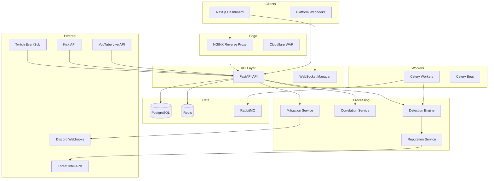
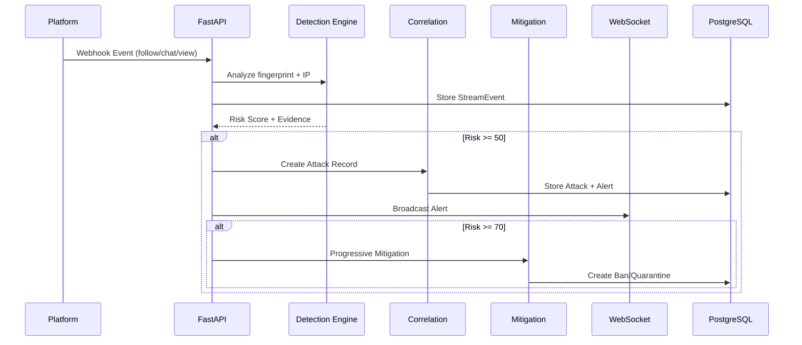
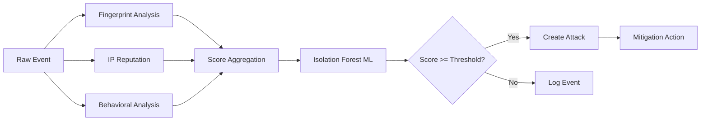

# StreamShield Architecture

## System Overview

StreamShield is an enterprise anti-bot security platform for live streamers on Twitch, Kick, and YouTube Live.

## Event Flow

## Detection Pipeline

## Multi-Tenant Model

- Each **Tenant** represents a streamer organization
- **Users** belong to tenants with RBAC roles
- **Streams** are linked to platforms (Twitch/Kick/YouTube)
- All security data is tenant-isolated

## Security Layers

| Layer | Implementation |
|-------|---------------|
| Transport | TLS 1.3, HSTS, secure WebSockets |
| Authentication | JWT + refresh tokens, token blacklist |
| Authorization | RBAC (5 roles) |
| Rate Limiting | Redis distributed rate limiter |
| Input Validation | Pydantic v2 strict schemas |
| Encryption | AES-256 Fernet for OAuth tokens |
| Headers | CSP, X-Frame-Options, nosniff |
| Audit | Immutable audit log table |

## Scalability Strategy

- **Horizontal**: API replicas behind NGINX, HPA in Kubernetes
- **Async**: Celery workers for detection/correlation
- **Cache**: Redis for rate limits, bans, IP reputation
- **Database**: Connection pooling, indexed queries, future partitioning by tenant_id
