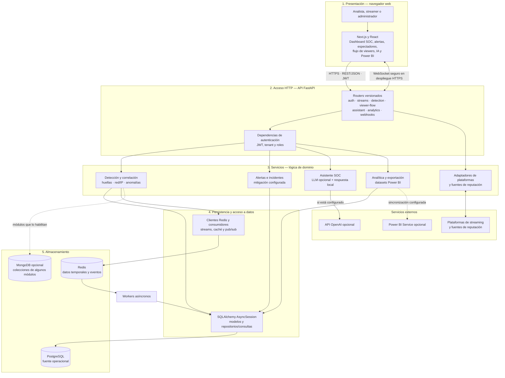
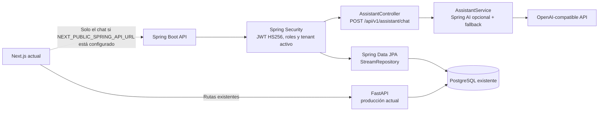
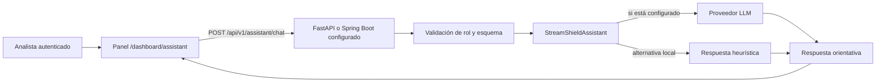
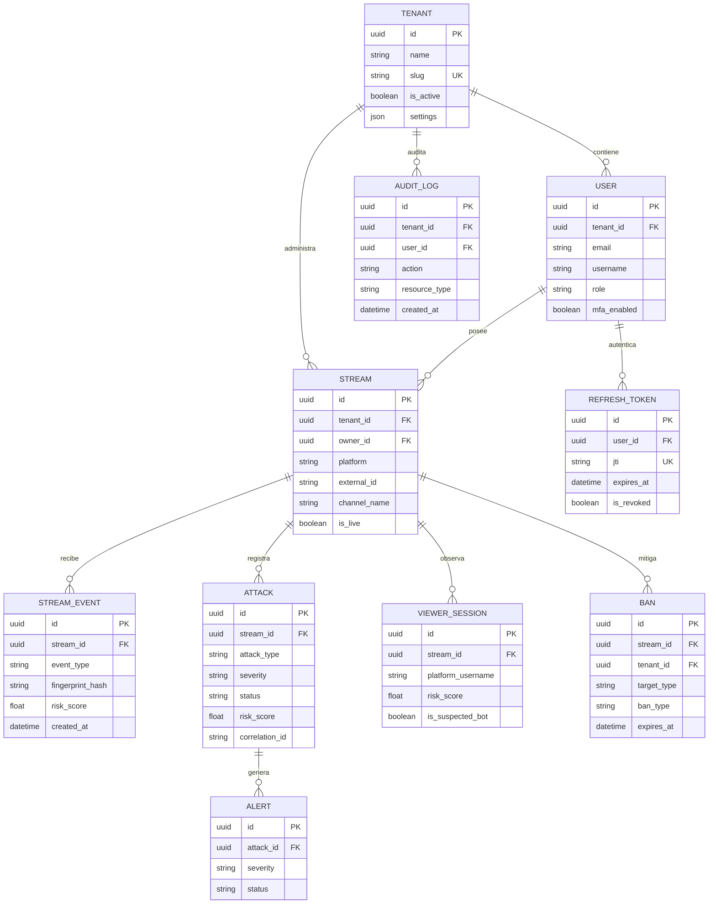
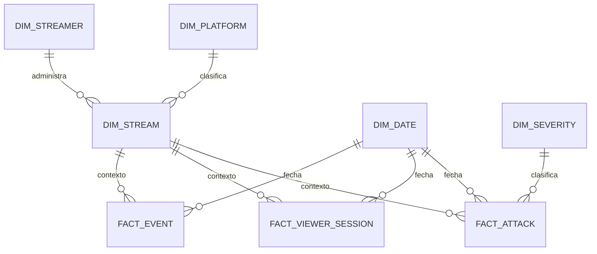

# Documentación de entregables académicos — StreamShield

**Proyecto:** StreamShield — monitoreo y análisis de amenazas en transmisiones en vivo  
**Repositorio:** [NlsG09201/Anti-Bots](https://github.com/NlsG09201/Anti-Bots)  
**Fecha de corte de la documentación:** 9 de octubre de 2026

## Alcance y fidelidad técnica

Este documento reúne la evidencia del repositorio para los requisitos de Desarrollo Web Avanzado, Visualización de Datos II e Investigación de Operaciones. Distingue entre capacidades implementadas, prototipos respaldados por código y propuestas académicas. No presenta una tecnología como implementada si no existe evidencia en el proyecto.

La aplicación en producción utiliza **Next.js/React**, **FastAPI/Python**, **PostgreSQL** y **Redis**. Se añadió un servicio complementario aislado en **Spring Boot 3.5**, con Spring Security, Spring Data JPA y Spring AI para el agente SOC y una consulta de canales por tenant. El módulo Java ya compila y pasa sus pruebas, pero todavía no sustituye la API FastAPI ni sus demás rutas. La migración es progresiva para conservar las funciones de producción mientras se completa la paridad.

## 1. Desarrollo Web Avanzado

### 1.1 Arquitectura de la aplicación

El diseño adapta las capas de presentación, controlador, servicio, acceso a datos, modelo y base de datos del esquema de referencia al sistema real. La capa de presentación está en `frontend/src/app/` y consume `frontend/src/lib/api.ts`. La API existente registra routers FastAPI versionados desde `backend/app/main.py`. El nuevo módulo Spring agrega las primeras rutas Java de forma independiente y reutiliza el formato de JWT actual. El frontend puede dirigir el chat a Spring mediante `NEXT_PUBLIC_SPRING_API_URL`; si no se configura, sigue usando FastAPI.

Los servicios operacionales de detección, correlación, alertas, mitigación y analítica siguen en `backend/app/services/`; el módulo Java está en `backend-spring/`. FastAPI conserva SQLAlchemy y `AsyncSession`; Spring Data JPA consulta las tablas compartidas `users` y `streams`, con Hibernate configurado para no alterar el esquema. PostgreSQL conserva los registros operacionales y Redis mantiene elementos temporales y flujos de eventos. Spring AI puede conectarse a OpenAI o a un proveedor compatible configurado por entorno; el fallback local sigue disponible. La API Java aún no implementa WebSocket, OAuth de plataformas, ingestión ni el conjunto de detección/mitigación.

| Capa del esquema de referencia | Adaptación concreta en StreamShield | Responsabilidad |
| --- | --- | --- |
| Presentación web | Next.js, React y componentes del dashboard | Mostrar SOC, señales, vistas y formularios; iniciar llamadas protegidas y recibir actualizaciones. |
| Controller | Routers FastAPI existentes y `AssistantController` Spring | Atender las rutas actuales y las rutas Java migradas; validar entradas y delegar. |
| Service | Servicios FastAPI existentes y `AssistantService` Java | Ejecutar lógica de dominio; el agente asesora y no aplica sanciones. |
| Repository / acceso a datos | SQLAlchemy en Python y `UserRepository` / `StreamRepository` en Spring Data JPA | Consultar los datos operacionales por tenant. Hibernate no modifica el esquema compartido. |
| Model / entidades | Modelos SQLAlchemy y entidades Java de lectura en `backend-spring/` | Mapear las tablas compartidas requeridas por cada módulo migrado. |
| Base de datos | PostgreSQL compartido; Redis para revocación opcional y flujos actuales | Mantener una sola fuente operacional mientras coexisten los servicios. |
| Integración de IA | Spring AI con proveedor compatible configurable y respuesta local | Orientar al analista sin ejecutar bloqueos ni sustituir revisión humana. |

### 1.2 Agente inteligente y LLM

El asistente existente continúa en `backend/app/services/assistant/service.py`. Su nueva implementación Java está en `backend-spring/src/main/java/com/streamshield/api/assistant/`, usa Spring AI y conserva el contrato de respuesta del endpoint FastAPI. El frontend envía el chat a Spring solo cuando `NEXT_PUBLIC_SPRING_API_URL` está configurado; de lo contrario, usa el backend actual. Spring AI se habilita con `AI_ENABLED=true` y una clave de proveedor; sin esa configuración o ante un error del proveedor, responde el fallback local. Ninguna variante ejecuta mitigaciones.

**Prototipo de clases real:** `AssistantPage` mantiene la conversación temporal en el estado del navegador y llama a `api.assistant.chat`; `chat_with_assistant` valida el usuario mediante la dependencia `AnalystUser`, acepta `AssistantChatRequest` y entrega `AssistantChatResponse`; `StreamShieldAssistant.answer` decide entre proveedor LLM y respuesta local. Los esquemas limitan el mensaje a 1.000 caracteres y el historial a seis mensajes. No se almacena una conversación en una tabla de base de datos.

### 1.3 Control de acceso y seguridad

FastAPI mantiene sus controles existentes. En las rutas Java migradas, Spring Security valida el JWT HS256 compartido, limita el acceso por rol y la capa de servicio verifica que la cuenta siga activa y corresponda al tenant del token:

| Requisito | Evidencia y comportamiento actual |
| --- | --- |
| Autenticación | FastAPI valida JWT de acceso en `backend/app/api/dependencies.py`; Spring Security usa el mismo `JWT_SECRET_KEY`, exige `type=access` y valida expiración y claims de identidad. |
| Autorización | `AnalystUser` en FastAPI y `SecurityFilterChain`/`@PreAuthorize` en Spring permiten los roles `analyst`, `admin` y `super_admin` para rutas protegidas. |
| Contraseñas y tokens | `backend/app/core/security.py` usa bcrypt para verificar contraseñas; define JWT de acceso y renovación, y cifrado Fernet para valores sensibles. |
| Sesiones y revocación | `RefreshToken` y `TokenBlacklist` están definidos en el modelo actual; FastAPI usa Redis. Spring consulta la misma clave con `SPRING_CHECK_REDIS_BLACKLIST=true` y `REDIS_URL`; en `APP_ENV=production` ambas opciones son requisito de arranque. |
| Validación de entrada | Esquemas Pydantic limitan longitud y forma del mensaje/historial del asistente. |
| Protección web | El proyecto incluye middleware y módulos de CSRF, rate limiting, cabeceras y gateway en `backend/app/infrastructure/security/`. La aplicación debe desplegarse detrás de HTTPS; WSS depende de ese despliegue. |
| Secretos | Las claves de proveedores y bases de datos se suministran por configuración/variables del entorno, no se incluyen en este documento. |

Estas referencias describen controles del código, no certifican una auditoría de seguridad ni que cada protección esté habilitada de igual manera en todos los entornos.

### 1.4 Modelo entidad-relación

El asistente no requiere tablas propias. El modelo operativo relevante está basado en las entidades declaradas en `backend/app/infrastructure/database/models.py`.

El diagrama resume relaciones y atributos de interés para el informe. Las claves, restricciones y campos completos deben consultarse en las clases del modelo; no se afirma que el diagrama sustituya el esquema de migraciones vigente.

### 1.5 Diccionario de datos resumido

| Entidad | Propósito | Campos representativos |
| --- | --- | --- |
| `tenants` | Aislar organizaciones y su configuración | `id`, `name`, `slug`, `is_active`, `settings` |
| `users` | Identidad, pertenencia y rol | `id`, `tenant_id`, `email`, `username`, `role`, `mfa_enabled` |
| `refresh_tokens` | Ciclo y revocación de sesión | `user_id`, `jti`, `expires_at`, `is_revoked` |
| `streams` | Canales supervisados | `tenant_id`, `owner_id`, `platform`, `external_id`, `channel_name`, `is_live` |
| `stream_events` | Eventos observados y señales de riesgo | `stream_id`, `event_type`, `ip_address`, `fingerprint_hash`, `risk_score`, `created_at` |
| `fingerprints` | Huellas y banderas de automatización | `hash`, indicadores headless/Selenium/Playwright, `occurrence_count`, `risk_score` |
| `ip_reputations` | Reputación y clasificación de red | `ip_address`, `asn`, `country_code`, `is_proxy`, `is_vpn`, `is_tor`, `reputation_score` |
| `attacks` | Incidentes agrupados/correlacionados | `stream_id`, `attack_type`, `severity`, `status`, `risk_score`, `evidence` |
| `alerts` | Seguimiento de notificaciones | `tenant_id`, `attack_id`, `severity`, `status` |
| `viewer_sessions` | Sesiones observadas en un canal | `stream_id`, `platform_username`, `risk_score`, `is_suspected_bot`, marcas de tiempo |
| `bans` | Registro de mitigaciones | `stream_id`, `tenant_id`, `target_type`, `ban_type`, `expires_at` |
| `audit_logs` | Trazabilidad de operaciones | `tenant_id`, `user_id`, `action`, `resource_type`, `created_at` |

**Repositorio:** [https://github.com/NlsG09201/Anti-Bots](https://github.com/NlsG09201/Anti-Bots)

## 2. Visualización de Datos II

### 2.1 Fuentes de datos y acceso

| Fuente | Tipo de dato | Acceso en el proyecto | Uso analítico |
| --- | --- | --- | --- |
| PostgreSQL | Relacional, operacional | Sesión SQLAlchemy del backend; modelos en `backend/app/infrastructure/database/models.py` | Canales, usuarios, eventos, sesiones, ataques y alertas. |
| Redis | Clave/valor y flujos de eventos | Cliente de caché/eventos en `backend/app/infrastructure/cache/` y `backend/app/events/` | Datos recientes, colas, límites y publicación; no es el repositorio histórico primario. |
| MongoDB | Documentos, opcional | Cliente e integraciones bajo `backend/app/infrastructure/mongodb/` | Algunas características o colecciones de inteligencia; su disponibilidad depende de configuración. |
| APIs de plataformas | Eventos y metadatos externos | Adaptadores en `backend/app/integrations/` | Twitch, Kick, YouTube y TikTok según permisos, APIs y variables configuradas. |
| Fuentes de reputación | Datos externos de IP/ASN | Integraciones en `backend/app/integrations/threat_intel/` | Enriquecimiento de señales; requiere las fuentes o credenciales pertinentes. |

Los datos exportados se filtran por tenant y ventana temporal a través de `AnalyticsWarehouseService` (`backend/app/services/analytics/powerbi.py`). Los endpoints documentados bajo `/api/v1/analytics/` exigen usuario analista o superior. El acceso efectivo a fuentes externas depende de credenciales, permisos y disponibilidad; no se presupone que el entorno de entrega tenga datos reales.

### 2.2 Modelo dimensional propuesto para análisis

El código define tablas de exportación y relaciones para Power BI; esto es un **modelo de datos analítico generado para consumo**, no un almacén dimensional independiente con tablas físicas de dimensiones y hechos. Para explicar su organización dimensional, se propone el siguiente esquema estrella lógico:

| Tabla lógica | Tipo | Grano y atributos principales |
| --- | --- | --- |
| `DIM_DATE` | Dimensión propuesta | Un registro por fecha; día, mes, trimestre y año. Se deriva de marcas temporales al preparar el informe. |
| `DIM_PLATFORM` | Dimensión derivada | Una fila por plataforma (`platform_key`, nombre). El catálogo se deriva de `platforms`. |
| `DIM_STREAMER` | Dimensión derivada | Un registro por streamer/tenant según las columnas exportadas; no exponer correo en informes compartidos. |
| `DIM_STREAM` | Dimensión derivada | Una fila por canal (`stream_id`, plataforma, streamer, nombre, estado). |
| `DIM_SEVERITY` | Dimensión propuesta | Catálogo de severidad/tipo de amenaza para ordenar y filtrar. |
| `FACT_ATTACK` | Hecho derivado | Una fila por ataque exportado; riesgo, confianza, usuarios afectados y estado. |
| `FACT_VIEWER_SESSION` | Hecho derivado | Una fila por sesión de espectador; duración, estado sospechoso y riesgo. |
| `FACT_EVENT` | Hecho derivado | Una fila por evento exportado; tipo, fecha y señal de riesgo. |

La implementación Power BI ya declara datasets `platforms`, `streamers`, `streams`, `viewers`, `suspicious_viewers`, `attacks`, `follows`, `engagement_metrics`, `ai_predictions`, `threat_scores`, `chat_activity` y `bot_profiles`, además de relaciones desde streams a sus registros analíticos. El esquema dimensional de arriba describe cómo organizar ese contrato para un análisis temporal; no asegura que exista un ETL persistente ni dimensiones físicas precargadas.

### 2.3 Prototipo de dashboard Power BI

Existe soporte de backend para metadatos, modelo, medidas, exportación de paquete y sincronización opcional con Power BI Service. Las rutas de análisis y exportación están en `backend/app/api/v1/powerbi_analytics.py`; la construcción del paquete y datasets está en `backend/app/services/analytics/powerbi.py`. La guía operativa está en [`POWERBI-ANALYTICS.md`](POWERBI-ANALYTICS.md) y [`POWER_BI_GUIDE.md`](../docs/POWER_BI_GUIDE.md).

El informe se plantea con páginas para: (1) resumen y tendencia de amenazas, (2) ataques por plataforma/severidad, (3) actividad sospechosa y sesiones, y (4) engagement y señales de IA. Las medidas declaradas incluyen conteos de ataques y sesiones, proporción sospechosa, severidad y engagement. El resultado es un **prototipo de modelo y exportación integrado en el backend**. No se afirma que haya un archivo `.pbix` publicado ni que Power BI Service esté conectado: la sincronización requiere que el propietario configure Azure/Power BI y sus variables de entorno.

## 3. Investigación de Operaciones

### 3.1 Problema real derivado de StreamShield

Durante un pico de actividad, el SOC puede detectar más sesiones sospechosas de las que el equipo puede revisar inmediatamente. Revisar o mitigar primero las sesiones de mayor prioridad permite usar capacidad limitada y reducir exposición. La puntuación del sistema sirve para ordenar la revisión, pero una puntuación no demuestra por sí sola que una cuenta sea un bot. Por ello, el modelo siguiente optimiza **priorización de revisión humana**, no bloqueos automáticos.

### 3.2 Modelo de programación lineal binaria

Para cada sesión candidata (i\), definir:

- (x_i \in \{0,1\}): vale 1 si la sesión se incluye en la revisión del periodo.
- (p_i \in [0,1]\): prioridad estimada a partir de señales disponibles, calibrada con datos etiquetados; no equivale a certeza.
- (t_i > 0\): minutos de revisión requeridos por la sesión, estimados por el equipo.
- (c_i \ge 0\): costo relativo de un falso positivo (afectar una sesión legítima).
- (B\): minutos de analista disponibles durante el periodo.
- (F\): límite acordado de exposición a falsos positivos, expresado como presupuesto de riesgo.

Una formulación es:

**Maximizar**  
\(\displaystyle \sum_i (p_i - \lambda c_i) x_i\)

**Sujeto a**

\(\displaystyle \sum_i t_i x_i \le B\)  (capacidad de revisión)

\(\displaystyle \sum_i c_i(1-p_i)x_i \le F\)  (presupuesto de riesgo de falso positivo)

\(x_i \in \{0,1\}\quad \forall i\)  (decisión de incluir o no cada sesión)

Aquí, \(\lambda \ge 0\) representa la aversión institucional a los falsos positivos. El valor de \(F\), los tiempos de revisión y \(\lambda\) deben acordarse y estimarse con el equipo; el repositorio no contiene una medición validada para asignarles valores reales. La puntuación de riesgo, en consecuencia, no debe presentarse como probabilidad calibrada salvo que se valide empíricamente.

**Interpretación:** la solución selecciona las sesiones con mayor valor esperado de revisión dentro del tiempo disponible y del umbral de riesgo aceptado. La salida recomienda qué revisar primero; la decisión de sancionar sigue en manos del analista. El modelo puede resolverse como mochila binaria con un solver de optimización, pero el repositorio no contiene actualmente un solver ni resultados experimentales de esta formulación.

## 4. Matriz de cumplimiento por objetivo

El porcentaje estima el avance documental y funcional demostrable en este repositorio. No equivale a una calificación del docente ni a la aprobación de un entregable externo. Los porcentajes reflejan que hay código y/o diseño en esta entrega; los elementos expresamente pendientes requieren evidencia independiente.

| Objetivo específico | Evidencia (sección o anexo) | Avance (%) | Pendiente para 8.º |
| --- | --- | ---: | --- |
| 1. Documentar arquitectura, agente inteligente, interfaz integrada, seguridad, modelo ER/diccionario y repositorio | Secciones 1.1–1.5; módulo Spring real en `backend-spring/`, seguridad JWT compartida, consulta JPA por tenant, agente conectado opcionalmente desde el frontend y repositorio enlazado. | 75% | Migrar las rutas restantes de FastAPI con compatibilidad de contrato y pruebas antes de sustituirlo; desplegar Spring con secretos propios y verificar el chat en el entorno integrado. Anexar capturas del despliegue final. |
| 2. Identificar fuentes, tipos y acceso; definir modelo dimensional y dashboard Power BI | Secciones 2.1–2.3; `powerbi.py`, `powerbi_analytics.py`, guía de Power BI y datasets/modelo de exportación. | 75% | Conectar las credenciales institucionales, importar/validar datos del entorno, construir y capturar el informe en Power BI Desktop/Service. El archivo publicado `.pbix` no se encuentra evidenciado en el repositorio. |
| 3. Plantear un problema real de Investigación de Operaciones con variables, objetivo y restricciones | Secciones 3.1–3.2; prioridad de revisión de sesiones sospechosas con límite de capacidad y presupuesto de falsos positivos. | 80% | Estimar parámetros con datos observados, documentar supuestos aprobados por el equipo y resolver el caso con datos del proyecto; añadir tabla de resultados y análisis de sensibilidad. |
| 4. Adjuntar evidencia y resultados analíticos respetando límite de plantilla | Este documento separa descripción, tablas y diagramas que pueden trasladarse como figuras/anexos. | 60% | Ajustar extensión a la plantilla oficial; incorporar capturas propias, resultados calculados, portada/formato exigidos y anexos numerados. |

### Evidencia que debe completar el equipo antes de entregar

1. Sustituir esta matriz por la matriz oficial si la plantilla del curso tiene columnas o criterios distintos.
2. Incluir capturas legibles del panel/flujo del agente y del informe Power BI, sin exponer tokens, correos, IP u otros datos personales.
3. Para Investigación de Operaciones, adjuntar un conjunto de datos autorizado y resultados del solver; no reportar valores supuestos como mediciones.
4. La integración Java es aditiva y no cambia el backend que atiende producción. Completar por módulos la paridad de FastAPI antes de cualquier cambio del origen general de API; no declarar migradas las funciones que aún viven en Python.
5. Revisar el límite de páginas de la plantilla y mover diagramas/tablas/capturas a figuras o anexos cuando corresponda.

## Referencias internas del proyecto

- [`backend-spring/README.md`](../backend-spring/README.md)
- [`ENTREGABLES-AGENTE-INTELIGENTE.md`](ENTREGABLES-AGENTE-INTELIGENTE.md)
- [`POWERBI-ANALYTICS.md`](POWERBI-ANALYTICS.md)
- [`DATA-STORES.md`](DATA-STORES.md)
- [`ENTERPRISE-ARCHITECTURE.md`](ENTERPRISE-ARCHITECTURE.md)
- [`GUIA-DEL-PROYECTO.md`](GUIA-DEL-PROYECTO.md)
