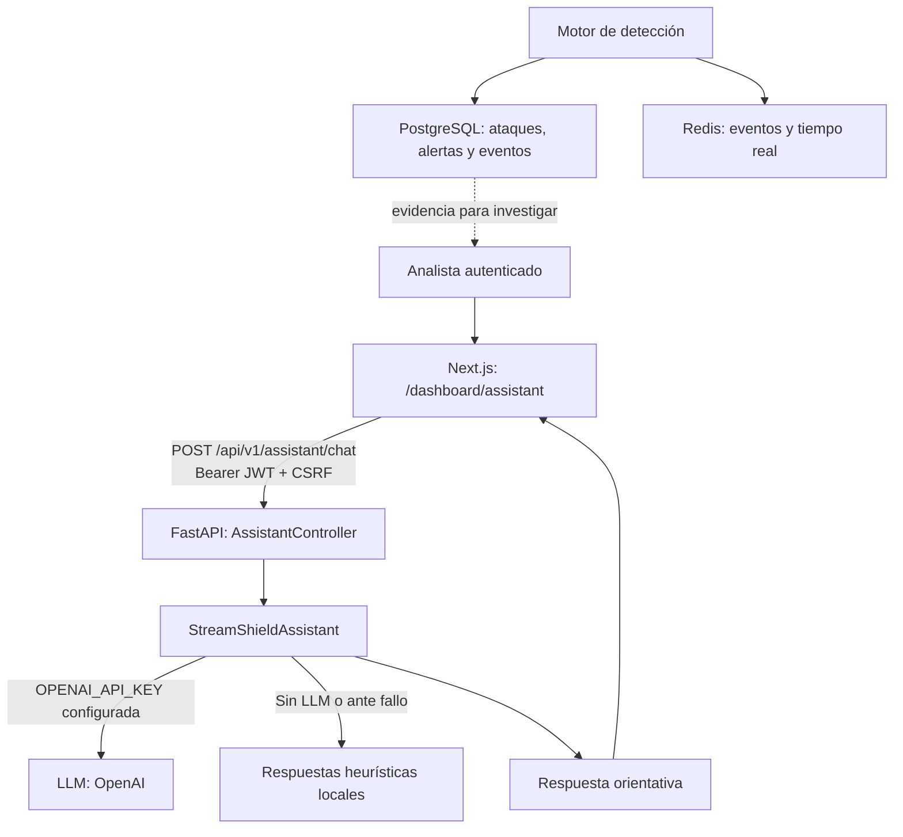
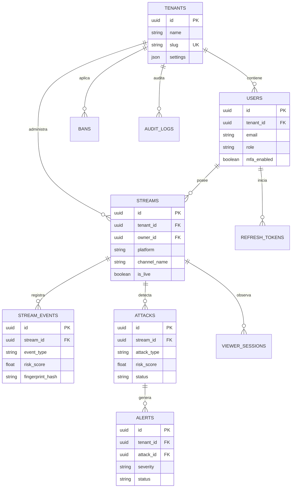

# Entregables: Agente Inteligente para StreamShield

## Adaptación al proyecto

La referencia entregada usa Spring Boot, Thymeleaf, JPA y MySQL para un sistema académico. StreamShield ya es una plataforma de seguridad para transmisiones en vivo, construida con **FastAPI (Python)**, **Next.js/React**, **PostgreSQL** y **Redis**. Por ello, la propuesta conserva la misma separación de responsabilidades, pero se implementa con las tecnologías reales del proyecto.

El agente no reemplaza al motor de detección ni toma acciones por su cuenta. Es un asistente conversacional de apoyo para que un analista entienda señales de *viewbotting*, spam, *followbotting*, huellas, puntajes de riesgo y acciones recomendadas.

## Arquitectura de la aplicación y del LLM



El servicio conversa únicamente sobre el dominio de StreamShield y aplica estas reglas:

- responde en español y de forma breve;
- no expone tokens, secretos ni direcciones IP completas;
- no confirma que una persona sea bot sin evidencia;
- no ejecuta bloqueos, expulsiones ni cambios de configuración;
- indica que las medidas irreversibles requieren revisión humana.

Si se configura `OPENAI_API_KEY`, se utiliza el modelo indicado por `OPENAI_MODEL`. Si no hay clave o el proveedor falla, el sistema sigue funcional con respuestas locales para los temas principales.

## Prototipo de clases del agente

```text
frontend/src/app/dashboard/assistant/page.tsx
  AssistantPage
    ├─ mantiene el historial temporal de la conversación
    ├─ muestra mensajes del usuario y del asistente
    └─ llama a api.assistant.chat(...)

backend/app/api/v1/assistant.py
  chat_with_assistant(payload, current_user)
    ├─ valida sesión y rol AnalystUser
    ├─ recibe AssistantChatRequest
    └─ devuelve AssistantChatResponse

backend/app/services/assistant/service.py
  StreamShieldAssistant
    ├─ answer(message, history)
    ├─ _ask_llm(message, history)          # integración opcional con LLM
    └─ _local_answer(message)              # fallback sin dependencia externa

backend/app/api/v1/schemas.py
  AssistantHistoryMessage
  AssistantChatRequest
  AssistantChatResponse
```

### Contrato de la conversación

| Elemento | Descripción |
| --- | --- |
| Endpoint | `POST /api/v1/assistant/chat` |
| Autorización | JWT Bearer y rol `analyst`, `admin` o `super_admin` |
| Entrada | `message` (1–1000 caracteres) e historial de hasta 6 mensajes |
| Salida | `answer`, `source` (`openai` o `local`) y aviso de revisión humana |
| Persistencia | El prototipo conserva el historial solo en el navegador durante la sesión; no almacena conversaciones ni datos personales adicionales |

La elección de no persistir el chat reduce la exposición de información operacional. Si se requiere historial auditable en una siguiente fase, se proponen las entidades `chat_conversations` y `chat_messages`, con `tenant_id`, `user_id`, retención limitada, cifrado y acceso restringido a administradores.

## Vista integrada en el front-end

La implementación está disponible en:

- `frontend/src/app/dashboard/assistant/page.tsx`
- `frontend/src/components/Sidebar.tsx`
- `frontend/src/lib/api.ts`

La nueva opción **SOC Assistant** aparece en el menú del panel. Su interfaz muestra el mensaje de alcance, los mensajes de la sesión, estado de consulta, errores y el requisito de rol. Usa el mismo mecanismo de autenticación de las demás vistas del dashboard.

## Evidencia de control de acceso y seguridad

El agente reutiliza los controles existentes y añade una barrera explícita de rol en su endpoint.

| Control | Evidencia en el proyecto | Aplicación al asistente |
| --- | --- | --- |
| Autenticación | `backend/app/core/security.py` genera y valida JWT | El endpoint exige `Authorization: Bearer` |
| Autorización por rol | `backend/app/api/dependencies.py` define `AnalystUser` | Solo `analyst`, `admin` y `super_admin` pueden conversar |
| Aislamiento por tenant | El JWT incluye `tenant_id`; consultas del sistema lo usan para separar datos | El agente no recibe ni consulta datos de otros tenants |
| CSRF | `CSRFMiddleware` y cliente web añaden `X-CSRF-Token` en operaciones mutables | El `POST` del chat se realiza con la misma protección |
| Límites y gateway | `SecurityGatewayMiddleware` y rate limit | Protegen la API contra abuso y automatización |
| Protección de credenciales | Variables de entorno y tokens cifrados | La clave del LLM no llega al navegador |
| Seguridad de la respuesta | Prompt de sistema + validación de tamaño/historial | Evita que el agente ejecute acciones o revele secretos |

## Modelo de datos actual (E-R)

El asistente no añade tablas en esta primera versión. Utiliza el modelo operacional existente para el dominio de seguridad:



## Diccionario de datos resumido

| Tabla | Propósito | Campos principales |
| --- | --- | --- |
| `tenants` | Separa organizaciones/cuentas del servicio | `id`, `name`, `slug`, `settings` |
| `users` | Usuarios y roles de cada tenant | `id`, `tenant_id`, `email`, `username`, `role`, `mfa_enabled` |
| `refresh_tokens` | Sesiones renovables revocables | `id`, `user_id`, `jti`, `expires_at`, `is_revoked` |
| `streams` | Canales que se supervisan | `id`, `tenant_id`, `owner_id`, `platform`, `channel_name`, `is_live` |
| `stream_events` | Señales recibidas de plataformas o widget | `id`, `stream_id`, `event_type`, `ip_address`, `fingerprint_hash`, `risk_score` |
| `fingerprints` | Huellas técnicas para correlación | `id`, `hash`, `automation_flags`, `occurrence_count`, `risk_score` |
| `ip_reputations` | Inteligencia y reputación de IP | `id`, `ip_address`, `asn`, `country_code`, `is_proxy`, `reputation_score` |
| `attacks` | Agrupación de evidencia de un ataque | `id`, `stream_id`, `attack_type`, `severity`, `risk_score`, `evidence` |
| `alerts` | Notificaciones operativas asociadas a ataques | `id`, `tenant_id`, `attack_id`, `severity`, `status` |
| `bans` | Medidas de mitigación aplicadas | `id`, `stream_id`, `tenant_id`, `target_type`, `ban_type`, `expires_at` |
| `audit_logs` | Trazabilidad de acciones del sistema | `id`, `tenant_id`, `user_id`, `action`, `resource_type`, `created_at` |
| `viewer_sessions` | Actividad de un espectador por canal | `id`, `stream_id`, `platform_username`, `risk_score`, `is_suspected_bot` |

La definición completa y ejecutable está en `backend/app/infrastructure/database/models.py`; la infraestructura de almacenamiento se describe en [DATA-STORES.md](DATA-STORES.md).

## Repositorio en GitHub

**Pendiente de completar por el propietario del proyecto:** `https://github.com/<organización-o-usuario>/<repositorio>`

No se incluye un enlace inventado ni se ha publicado código desde esta documentación. Una vez creado el repositorio remoto, sustituye el marcador por la URL real.

